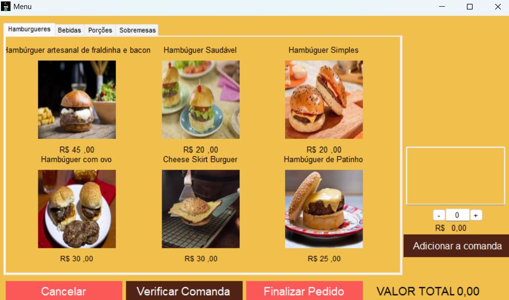

# CyberHamburgueria

CyberHamburgueria é um sistema de gerenciamento para lanchonetes, desenvolvido como parte de um projeto acadêmico. Ele permite o controle de pedidos, estoque e contas de funcionários, facilitando a administração do negócio e otimizando o atendimento.



## Tecnologias utilizadas


## Atores

No CyberHamburgueria, cada usuário desempenha um papel fundamental para garantir o bom funcionamento da lanchonete. O sistema foi projetado para atender às necessidades de diferentes atores, distribuindo responsabilidades de forma eficiente. Os principais atores do sistema são: Gerente, Atendente, Caixa e Cozinheiro, cada um com funções específicas que contribuem para a organização e agilidade no atendimento. A seguir, detalhamos as responsabilidades de cada um dentro da plataforma.

### Gerente

- Responsável por gerenciar o estoque e as contas.

### Atendente

- Responsável por registrar os pedidos na comanda.

### Caixa

- Reponsável por registrar o pagamento da comanda.

### Cozinheiro

- Responsável por verificar os pedidos e realizá-los.

## Comandas

As comandas são numeradas sequencialmente para organizar os pedidos. O sistema trabalha com comandas que vão do número 109 até 120.

## Pré requisito

Ter instalado na máquina o **Visual Studio 2022**. Você pode baixá-lo <a href="https://visualstudio.microsoft.com/pt-br/vs/community/">aqui</a>.

## Observação

O projeto contém uma lógica de vencimento para todos os itens do estoque, garantindo um melhor controle e evitando desperdícios. Para que os pedidos possam ser realizados no menu, é necessário que os itens estejam devidamente cadastrados no estoque.

## Como rodar localmente

1. Clone o repositório
    ```bash
    git clone git@github.com:CostaDenis/CyberHamburgueria.git
    ```

2. Abra o projeto:

- Navegue até a pasta do projeto.

- Clique duas vezes no arquivo "**CyberHamburgueria.sln**".

- Aguarde o carregamento no Visual Studio 2022.